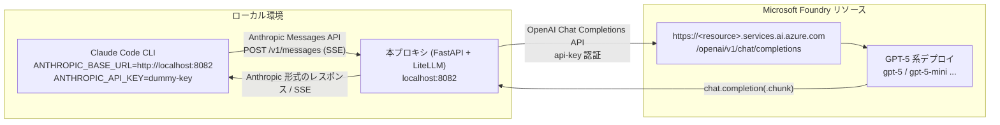

# Claude Code → GPT プロキシ 🔄

**Claude Code を Microsoft Foundry（または OpenAI）の GPT-5 系モデルで動かすためのプロキシ**です。

Claude Code が話す Anthropic Messages API を受け取り、OpenAI Chat Completions API に変換して GPT-5 系モデルへ中継し、レスポンスを Anthropic 形式に戻します。認証はすべて **API キーベース**です。

## アーキテクチャ



変換の流れ:

| 方向 | 変換内容 |
| --- | --- |
| Claude Code → GPT | モデル名のマッピング、`system` → `system` メッセージ、`tool_use` → `tool_calls`、`tool_result` → `role: "tool"`、画像ブロック → `image_url`、`thinking` → `reasoning_effort`、`max_tokens` → `max_completion_tokens` |
| GPT → Claude Code | `tool_calls` → `tool_use` ブロック、`finish_reason` → `stop_reason`、usage → `input_tokens` / `output_tokens`、ストリームを Anthropic の SSE イベントへ |

## 必要なもの

- [uv](https://github.com/astral-sh/uv)（Python 3.10 以上）
- Microsoft Foundry のリソースと **API キー**、および GPT-5 系モデルのデプロイ
  - OpenAI の API キーでも利用できます
- [Claude Code](https://www.npmjs.com/package/@anthropic-ai/claude-code)

## セットアップ

```bash
git clone https://github.com/yus04/claude-code-proxy.git
cd claude-code-proxy
cp .env.example .env
```

`.env` を編集します（Microsoft Foundry の場合）:

```dotenv
AZURE_API_BASE="https://<your-resource>.services.ai.azure.com"
AZURE_API_KEY="<your-foundry-api-key>"
```

Azure OpenAI deployment endpoints, including APIM endpoints such as
`https://<gateway>.azure-api.net/foundry/openai/deployments/<deployment>/chat/completions`,
use the endpoint's base path and its specified API version:

```dotenv
AZURE_API_BASE="https://<gateway>.azure-api.net/foundry/openai"
AZURE_API_KEY="<your-api-key>"
AZURE_API_VERSION="2025-03-01-preview"
```

OpenAI を使う場合は代わりに次を設定します（`AZURE_API_BASE` は設定しない）:

```dotenv
OPENAI_API_KEY="sk-..."
```

## 起動

```bash
uv run uvicorn server:app --host 0.0.0.0 --port 8082 --reload
```

`--reload` は開発用です。動作確認:

```bash
curl http://localhost:8082/health
```

## Claude Code から使う

Claude Code は Microsoft Foundry とネイティブ統合されており、`CLAUDE_CODE_USE_FOUNDRY` などが設定されていると `/login` を要求されます。本プロキシを使うときは Foundry ネイティブ統合の環境変数を解除し、`ANTHROPIC_BASE_URL` をプロキシに向けてください。

```bash
# Foundry ネイティブ統合を無効化（設定済みの場合）
unset CLAUDE_CODE_USE_FOUNDRY ANTHROPIC_FOUNDRY_RESOURCE ANTHROPIC_FOUNDRY_BASE_URL ANTHROPIC_FOUNDRY_API_KEY

# プロキシに接続（API キーはプロキシ側で使わないためダミーで可）
export ANTHROPIC_API_KEY="dummy-key"
export ANTHROPIC_BASE_URL="http://localhost:8082"

# ローカル設定（hooks やプラグイン等）を読み込まないクリーンな状態で起動
claude --bare
```

> `--bare` はローカル設定を読み込まずに起動するオプションです。`/login` を回避するのに重要なのは `CLAUDE_CODE_USE_FOUNDRY` 等が設定されていないことと、`ANTHROPIC_BASE_URL` / `ANTHROPIC_API_KEY` が設定されていることです。通常起動（`claude`）でも同様に動作します。

## モデルマッピング

Claude Code が送るモデル名は、ファミリー名（opus / sonnet / haiku）で判定してマッピングされます。日付付き ID（例: `claude-haiku-4-5-20251001`）もそのまま扱えます。

| Claude Code のモデル | 環境変数 | 既定のマッピング先 |
| --- | --- | --- |
| Claude Opus 5 (`*opus*`) | `BIG_MODEL` | `gpt-5` |
| Claude Sonnet 5 (`*sonnet*`) | `MIDDLE_MODEL` | `gpt-5` |
| Claude Haiku 4.5 (`*haiku*`) | `SMALL_MODEL` | `gpt-5-mini` |

上記に該当しないモデル名はそのまま転送されるため、Claude Code 側で `/model gpt-5-nano` のように GPT のモデル名を直接指定することもできます。Microsoft Foundry ではモデル名に**デプロイ名**を指定してください。

## 環境変数

| 変数 | 既定値 | 説明 |
| --- | --- | --- |
| `AZURE_API_BASE` | （未設定） | Foundry リソースのエンドポイント。設定すると Foundry 経由になります（`/openai/v1` は不要） |
| `AZURE_API_KEY` | （未設定） | Foundry リソースの API キー |
| `AZURE_API_VERSION` | `preview` | `preview` / `v1` / `latest` は OpenAI 互換の v1 API を使用。Azure OpenAI のデプロイメント URL や APIM を使う場合は、エンドポイントに指定された `2025-03-01-preview` などの日付値を設定 |
| `OPENAI_API_KEY` | （未設定） | OpenAI（または他の OpenAI 互換エンドポイント）の API キー |
| `OPENAI_BASE_URL` | `https://api.openai.com/v1` | OpenAI 互換エンドポイントの URL |
| `BIG_MODEL` / `MIDDLE_MODEL` / `SMALL_MODEL` | `gpt-5` / `gpt-5` / `gpt-5-mini` | opus / sonnet / haiku のマッピング先 |
| `REASONING_EFFORT` | `medium` | 既定の推論の深さ（`none` / `minimal` / `low` / `medium` / `high` / `xhigh`） |
| `MAX_OUTPUT_TOKENS` | `32768` | GPT 側に渡す出力トークンの上限 |
| `PORT` | `8082` | `python server.py` で起動する際の待ち受けポート |

## GPT-5 系 API の差分への対応

GPT-5 以降の推論モデルは Chat Completions API の仕様が GPT-4 系と異なります。本プロキシはその差分を吸収します。

- `max_tokens` は使えないため **`max_completion_tokens`** に変換します（`MAX_OUTPUT_TOKENS` で上限も調整）。
- `temperature`（1 以外）、`top_p`、`top_k`、`stop`、ペナルティ系のパラメーターは推論モデルでは受け付けられないため、自動的に除外します（`litellm.drop_params`）。
- Anthropic の拡張思考（`thinking.budget_tokens`）を **`reasoning_effort`** に変換します。

| `thinking.budget_tokens` | `reasoning_effort` |
| --- | --- |
| 指定なし / 無効 | `REASONING_EFFORT`（既定 `medium`） |
| ～2,048 | `low` |
| ～16,384 | `medium` |
| 16,385～ | `high` |

## エンドポイント

| エンドポイント | 用途 |
| --- | --- |
| `POST /v1/messages` | メッセージ生成（ストリーミング対応） |
| `POST /v1/messages/count_tokens` | トークン数の見積り |
| `GET /v1/models` | Claude Code がゲートウェイ利用時に参照するモデル一覧 |
| `GET /health` | 設定内容の確認 |

## Docker

```bash
docker run -d --env-file .env -p 8082:8082 ghcr.io/yus04/claude-code-proxy:latest
```

docker compose の例:

```yaml
services:
  proxy:
    image: ghcr.io/yus04/claude-code-proxy:latest
    restart: unless-stopped
    env_file: .env
    ports:
      - 8082:8082
```

## テスト

外部 API を呼ばないオフラインのテストが同梱されています。

```bash
uv run pytest
```

## ライセンス / コントリビュート

Pull Request を歓迎します 🎁
